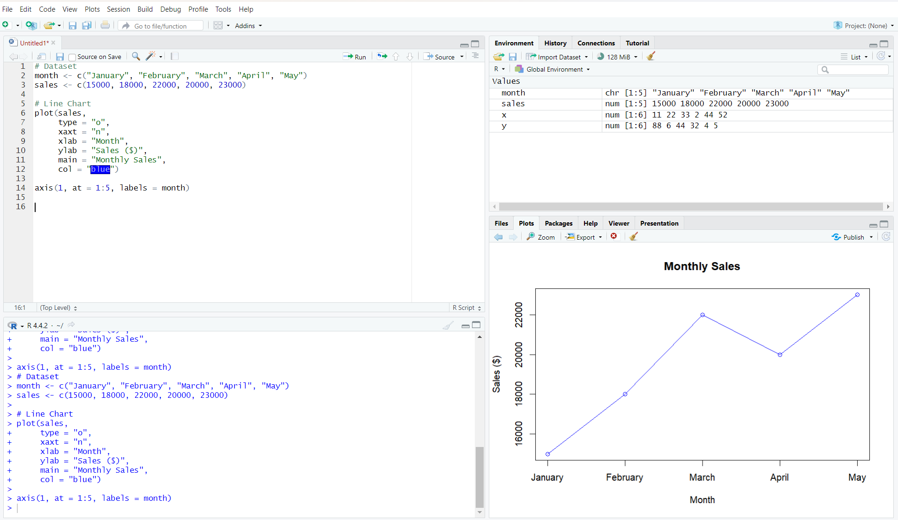
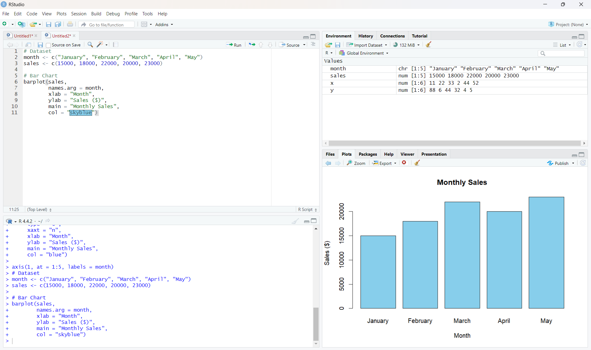
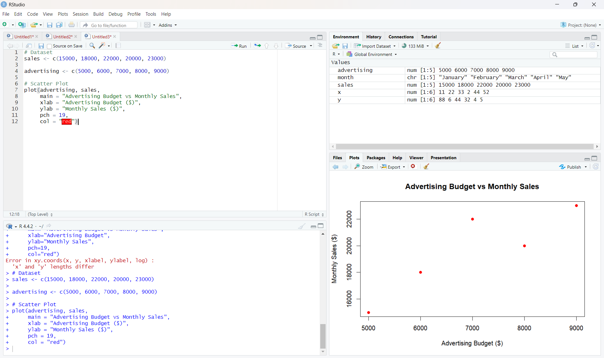
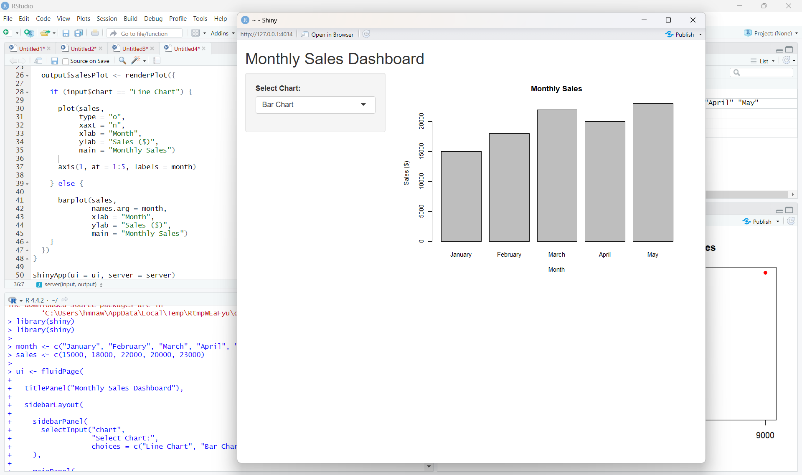
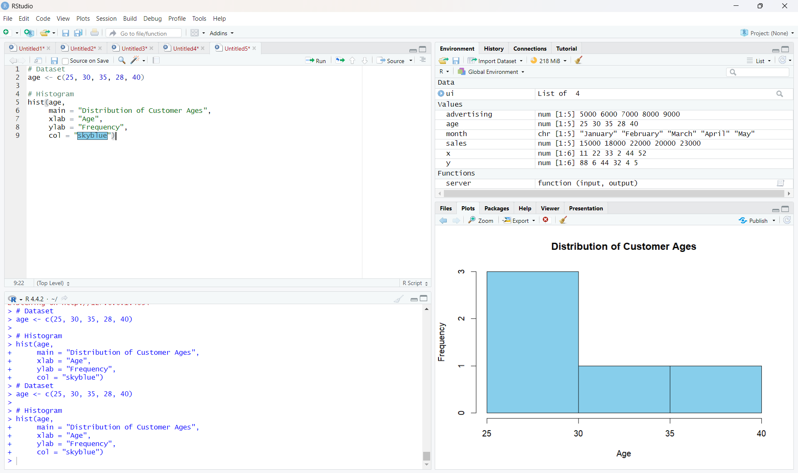
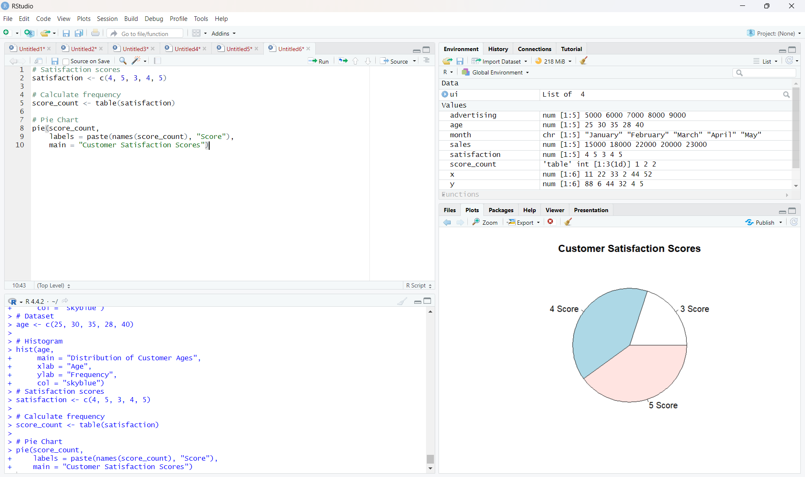
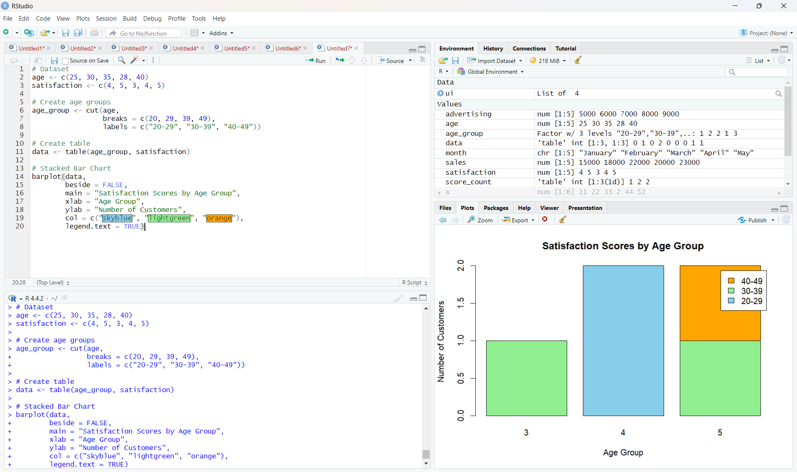
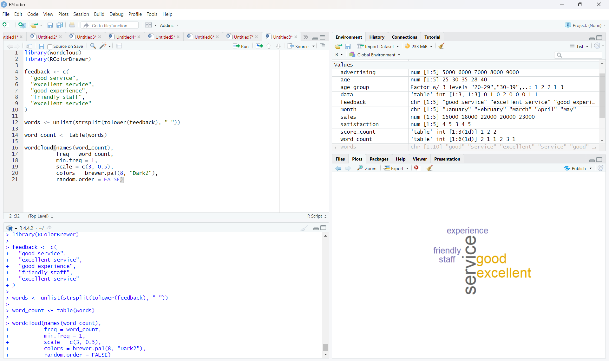

# 📊 Program Outputs

## 1. Monthly Sales Line Chart

---

## 2. Monthly Sales Bar Chart

---

## 3. Advertising Budget vs Monthly Sales

---

## 4. Monthly Sales Dashboard

---

## 5. Customer Age Distribution

---

## 6. Customer Satisfaction Scores

---

## 7. Satisfaction Scores by Age Group

---

## 8. Customer Feedback Word Cloud

---

## 9. Employee Performance Trend

---

## 10. Employees by Department

---

## 11. Years of Service vs Performance Score

---

## 12. Tableau Employee Performance Dashboard

